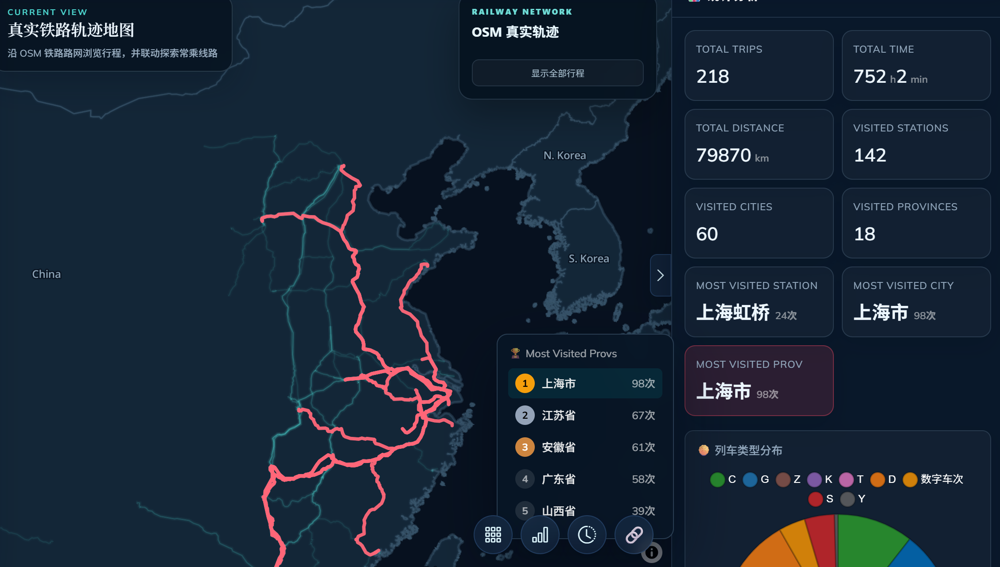

# Travel Atlas

Travel Atlas 是一个个人交通与城市探索可视化档案。主页将航空、铁路、公路、骑行和城市探索地图整合在同一个静态界面中，并提供铁路与航空统计分析。
大家可以试用一下点点star

## 使用说明

点击下方标题，可在“快速上手版”和“进阶完整版”两套说明之间切换。

<details open>
<summary><strong>🚀 快速上手版：上传表格立即绘图</strong></summary>

### 在线启动

[**打开 TravelAtlas 快速上手版 →**](https://ethenone.github.io/Travel-map/TravelAtlas.html)

快速上手版是纯静态网页。表格只在当前浏览器中解析和绘制，不会上传到服务器。

### 四步开始

1. 打开上面的启动链接，点击顶部醒目的“下载导入模板”。
2. 保留模板表头，用自己的行程覆盖示例数据；支持 Excel（`.xlsx` / `.xls`）和 CSV。
3. 点击“导入数据”或把文件拖入左侧区域。导入会覆盖当前表格，并立即重绘航空、铁路连线与右侧统计。
4. 可直接在表格中继续修改，使用“适应视图”查看全部线路，完成后用“导出 CSV”保存。

### 模板包含的三类示例

| 类型 | 出发 → 到达 | 写法说明 |
| --- | --- | --- |
| 国际航空 | `LHR` → `JFK` | 使用国际通行的 IATA 三字码 |
| 中国航空 | `广州白云` → `上海虹桥` | 使用基础库中可匹配的中国机场全名 |
| 铁路 | `上海虹桥` → `杭州东` | 使用火车站名称 |

每一行代表一次行程。核心字段如下：

| 字段 | 是否必填 | 说明 |
| --- | --- | --- |
| `类型` | 是 | 填写 `航空` 或 `铁路` |
| `出发`、`到达` | 是 | 航空可用 IATA 三字码或可匹配的中国机场全名；铁路使用车站名 |
| `日期`、`航班/车次` | 否 | 用于表格展示和统计 |
| `时长(分钟)`、`里程(km)` | 否 | 留空时，里程会根据两端坐标估算 |
| 四个经纬度字段 | 否 | 基础库无法匹配地点时，可手动填写 |

注意：

- 上传新文件会覆盖网页当前表格；需要保留修改时，请先“导出 CSV”。
- 未匹配的机场或车站会显示在右侧“数据质量”区域。
- 页面部署在 GitHub Pages，建议使用最新版 Chrome、Edge、Firefox 或 Safari。

### 城市探索快速模式

[**打开中国城市探索快速模式 →**](https://ethenone.github.io/Travel-map/TravelAtlasCity.html)

“连线地图”和“城市探索”按钮位于两个快速模式页面顶部的相同位置，可随时往返切换。城市探索页面提供以下操作：

1. 在左侧搜索城市或按省份筛选，然后通过城市右侧的下拉框选择探索等级。
2. 也可以先在地图下方选择等级，再直接点击城市区块进行涂色。
3. 使用地图右上角的“省级聚合”，按省内城市的**最高探索等级**统一着色；右侧列表同时保留已探索城市数和覆盖率。
4. 修改会自动保存在当前浏览器中。使用“导出等级”可保存 JSON 备份。

探索等级依次为：

| 等级 | 状态 | 说明 |
| --- | --- | --- |
| `0` | 未到访 | 尚未到达该城市 |
| `1` | 途经 | 仅从城市范围内经过 |
| `2` | 停留 | 在城市内短暂停留，包括下车或换乘 |
| `3` | 游览 | 在城市内进行过游览或活动 |
| `4` | 住宿 | 至少在城市内住宿一晚 |
| `5` | 居住 | 曾在城市内长期居住 |

#### 下载模板与一键导入

- 点击“下载模板”会生成包含全部城市的 CSV，字段为 `城市`、`省份`、`代码`、`等级`。
- 修改 `等级` 为 `0`–`5` 后，点击“一键导入”选择文件即可更新地图。
- 导入支持 CSV、Excel（`.xlsx` / `.xls`）和页面导出的 JSON。
- 导入时优先按照六位行政代码匹配；没有代码时使用“省份 + 城市”匹配。未出现在导入文件中的城市会保留当前等级。
- 旧文件中的二级状态“下车”仍会按“停留”导入。

“一键清空”会在确认后把全部城市设为 `0`；如需撤销，可点击“恢复现有记录”，重新载入项目生成时的城市探索数据。浏览器的隐私模式、清除网站数据或更换设备不会保留本机修改，重要记录请先导出。

</details>

<details>
<summary><strong>🧭 进阶完整版：多地图、统计与本地生成工具</strong></summary>

进阶完整版保留原项目的航空、铁路、公路、骑行、城市探索地图，以及本地数据生成和真实铁路轨迹匹配流程。

[**打开 Travel Atlas 进阶完整版 →**](https://ethenone.github.io/Travel-map/)

## 示例

[Travel Atlas](https://ethenone.github.io/Travel-map/)

<p align="center">
  <a href="./docs/images/travel-atlas-overview.png">
    
  </a>
  <a href="./docs/images/travel-atlas-example-2.png">
    
  </a>
</p>
<p align="center">
  <a href="./docs/images/travel-atlas-example-3.png">
    
  </a>
  <a href="./docs/images/travel-atlas-example-4.png">
    
  </a>
</p>

<p align="center"><sub>点击截图可查看原图</sub></p>

## 项目结构

```text
travel-map/
├─ index.html                  # 页面语义结构与地图容器
├─ TravelAtlas.html            # 快速模式：航空与铁路连线编辑器
├─ TravelAtlasCity.html        # 快速模式：中国城市探索等级编辑器
├─ static/css/travel-map.css  # 页面专用视觉与响应式样式
├─ static/js/travel-map.js    # 地图切换、统计表格与图表交互
├─ reference-data/             # 公开的机场与国内火车站基础数据
├─ data/                       # 生成的统计、城市边界与探索等级数据
├─ map/                        # 生成的独立地图页面
├─ utils/                      # 地图与统计生成脚本
├─ pic/                        # 航司与联盟图标
└─ testing/                    # Notebook 和交互原型
```

原始记录不属于本仓库，而是放在并列的私人目录中：

```text
../
├─ travel-map/   # 本仓库
└─ database/     # 私人 Excel、CSV、GeoJSON 和活动轨迹
```

机场和国内火车站基础数据已放在仓库的 `reference-data/` 中；私人乘坐记录、大型 OSM 铁路数据及活动轨迹仍由生成脚本从 `../database` 读取。网页运行时只访问已经生成的 `data/*.json` 和 `map/*.html`。

## 本地运行

在 Windows 上运行 `localtest.bat`，或在项目根目录执行：

```powershell
python -m http.server 8000 --bind 127.0.0.1
```

然后打开 <http://127.0.0.1:8000/index.html>。不要直接双击 `index.html`，浏览器可能阻止页面读取本地 JSON 文件。

## 路线图输入数据

仓库内的公共基础数据使用固定路径，脚本会根据自身位置查找，不依赖当前工作目录：

- `reference-data/airports_data.csv`：UTF-8；路线图实际使用 `iata`、`lat`、`lon`。
- `reference-data/stations_data.csv`：UTF-8；路线图与统计实际使用 `车站`、`经度`、`纬度`、`省`、`市`、`路局`。

私人行程文件仍放在与本仓库并列的 `../database/` 中。车站名称和 IATA 代码必须能在上述基础数据中匹配，否则对应路线会被跳过。

### 全球飞机/火车连线图

运行 `draw_connecting_lines.bat`，入口脚本为 `utils/draw_globe_routes.py`。需要以下文件和字段：

| 文件                                 | 工作表             | 必需列                | 可选列/说明                                     |
| ---------------------------------- | --------------- | ------------------ | ------------------------------------------ |
| `reference-data/airports_data.csv` | CSV             | `iata`、`lat`、`lon` | 提供机场坐标，项目已包含                               |
| `../database/飞机乘坐记录.xlsx`          | 第一个工作表          | `start`、`depart`   | `起飞`、`降落`用于显示名称；`航班号`或`航班`用于显示班次           |
| `reference-data/stations_data.csv` | CSV             | `车站`、`经度`、`纬度`     | 提供国内车站坐标                                   |
| `../database/火车乘坐记录.xlsx`          | 第一个工作表（当前为 `1`） | `上车站`、`下车站`        | `车次`用于路线提示                                 |
| `../database/境外铁路乘坐记录.xlsx`        | `乘坐列表`          | `上车站`、`下车站`        | `车次`（该表可选择性使用） |
| `../database/境外铁路乘坐记录.xlsx`        | `车站位置`          | `车站`、`lat`、`lon`   | 提供境外车站坐标（该表可选择性使用）                         |

脚本把航空路线绘制为球面最短路径，并将国内、境外铁路以站间连线加入同一张 `map/map_line.html`。

### OSM 真实铁路路线图

线路轨迹由openStreetMap获取，后续将期望将这部分改造为快速版本

运行 `draw_railway_route.bat`。匹配阶段由 `utils/build_real_rail_routes.py` 完成，渲染阶段由 `utils/draw_real_railway_map.py` 完成。

| 文件                                           | 工作表/格式  | 必需字段                                                                 | 说明                                        |
| -------------------------------------------- | ------- | -------------------------------------------------------------------- | ----------------------------------------- |
| `reference-data/stations_data.csv`           | CSV     | `车站`、`经度`、`纬度`、`省`、`市`                                               | 车站坐标及地区归属                                 |
| `../database/火车乘坐记录.xlsx`                    | `1`     | 前 5 列依次为 `序号`、`日期`、`车次`、`上车站`、`下车站`；第 6 列起为按顺序排列的途经车站                | `序号`用于关联其他工作表                             |
| `../database/火车乘坐记录.xlsx`                    | `乘坐列表`  | `序号`、`日期`、`车次`、`上车站`、`下车站`                                           | 建议同时提供 `时长.1`、`里程`、`上车城市`、`下车城市`，供统计和筛选使用 |
| `../database/火车乘坐记录.xlsx`                    | `线路`    | `序号`、`线路`                                                            | `线路`作为匹配时的线路提示；留空时仍可匹配                    |
| `../database/railway_route/railways.geojson` | GeoJSON | `LineString`/`MultiLineString` 几何，属性 `railway`、`id`、`name`、`name_zh` | 仅处理 `railway=rail` 的要素                    |

首次运行会在 `../database/railway_route/rail_network_v3.pkl` 建立铁路网络缓存；仅当 `railways.geojson` 变化或使用 `--rebuild-network` 时才需要重建。输出包括：

- `data/rail_routes_real.geojson`：每次铁路行程匹配后的真实轨迹与质量标记。
- `data/rail_line_stats.json`：由实际经过的 OSM 轨道名称归纳的线路统计。
- `data/rail_area_stats.json`：城市与省份的车站覆盖统计。
- `map/map_rail.html`：可交互的真实铁路轨迹地图。

## 公路轨迹图

使用了<https://github.com/yihong0618/running_page>和<https://github.com/gpxstudio/gpx.studio>来处理轨迹，生成的activities.json放在../database中

## 中国城市探索等级

快速模式入口为 `TravelAtlasCity.html`。页面读取：

- `data/china_city_boundaries.geojson`：浏览器使用的地级市边界、城市名、行政代码和省级归属。
- `data/city_exploration_seed.json`：从现有记录提取的城市探索等级，用于首次打开和“恢复现有记录”。

两份文件由 `utils/build_city_exploration_assets.py` 从并列的私人目录读取 `中国_市.geojson` 和 `途径市.xlsx` 后生成。输出仅保留地图展示所需的城市边界与数字等级，不包含其他私人表格内容。

## 重新生成内容

确保 `travel-map` 与私人 `database` 位于同一父目录。仓库已经包含机场和国内火车站基础数据，然后可按需运行：

- `draw_connecting_lines.bat`：生成球面航空与铁路连接地图。
- `draw_railway_route.bat`：匹配 OSM 真实铁路轨迹、更新线路与地区统计并生成铁路地图。
- `draw_keep_route.bat`：生成公路与骑行轨迹地图。
- `draw_city_count.bat`：生成中国城市探索地图。
- `python utils/build_city_exploration_assets.py`：更新快速模式使用的城市边界和初始探索等级。
- `draw_shanghai_exploration.bat`：生成上海探索地图。
- `draw_conclusion.bat`：更新 `data/charts.json`、`data/stats.json` 和 `data/rail_area_stats.json`。
  其中航空总时间、总里程会写入 `stats.json`，供“仅航空”和“航空 + 火车”统计切换使用。

生成脚本会覆盖对应的地图或统计产物，运行前应确认私人数据表结构与脚本预期一致。

## 前端依赖

页面使用 Bootstrap、MapLibre GL JS、Leaflet/Folium、Chart.js、D3 和 ECharts。地图文件以 iframe 嵌入；铁路统计通过同源 `postMessage` 与铁路地图联动。

无法连通或出现明显绕行的局部铁路区段会使用同色站点直线补齐，不在地图中额外区分。质量警告、失败区段及直线补齐清单保存在 `data/rail_line_stats.json`。右侧火车统计中的“线路统计”根据实际经过的 OSM 同名轨道自动生成，包含估算覆盖度、涉及行程频率和最常乘坐的相邻车站区间。

</details>
